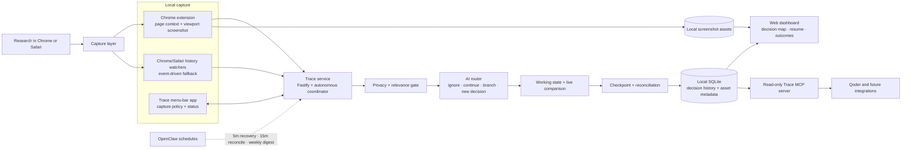

# Trace — Git for your recurring decisions

> An autonomous, local-first memory for research-backed decisions.

## Overview

Trace treats research-backed decisions the way Git treats code changes: as first-class, revisitable objects with a working state, evidence, checkpoints, branches, outcomes, and history.

Whenever people research an important decision—choosing a model, treatment, product, vendor, methodology, destination, or strategy—they open many sources, reach a conclusion, and eventually forget why. Later, when they revisit the same choice, they often repeat the investigation from zero. Trace preserves what they investigated, what they concluded, why they concluded it, and what changed when they revisited it.

Trace is designed to require no filing ritual or approval queue. While the user browses, it identifies decision-relevant evidence, safely captures visual context, decides where that evidence belongs, updates a live research state, and creates durable checkpoints automatically. The result is a visual research story that answers:

- What is the best current answer?
- Which sources and screenshots support it?
- What changed between research sessions?
- Which questions remain unresolved, and where should research resume?
- Did the decision work in practice?

### How the decision loop works

1. **Capture** — Chrome sends bounded page context and an approved visible-viewport screenshot; Chrome/Safari history watchers provide a resilient fallback.
2. **Understand** — A privacy and decision-relevance gate rejects sensitive pages and ordinary browsing before the autonomous router chooses ignore, continue, branch, or new decision.
3. **Work** — Relevant evidence updates the branch-owned working tree and live comparison immediately.
4. **Commit** — After roughly 25 seconds without new evidence, Trace writes an in-progress or resolved checkpoint. A useful recommendation can resolve while minor validation remains visible.
5. **Reconcile and revisit** — Compatible branches reconcile automatically, materially different contexts remain separate, and closed decisions can reopen when relevant evidence returns.
6. **Learn from outcomes** — The user can record whether a decision worked, was mixed, was regretted, or was superseded; that result becomes part of future retrieval.

## Core Concepts

| Concept | Description |
|---------|-------------|
| **Thread** | A recurring decision topic (e.g., "Postgres vs Mongo") |
| **Working tree** | The live, pre-commit research state: question, options, constraints, open questions, and tentative direction |
| **Commit** | An automatic checkpoint: what you read, the current conclusion, and why; an actionable recommendation can resolve even when minor validation remains |
| **Branch** | A reopening in a different context that may diverge from the trunk's verdict |
| **Merge** | Reconciling two branches into one durable rule |
| **Outcome** | An after-action review attached to a resolved decision: worked, mixed, regretted, or superseded |
| **Diff** | What's different about the current context vs. the prior commit's context |
| **Comparison** | A source-backed option/criterion matrix maintained by Trace; unknowns stay explicit and user corrections are preserved |

## Target User

- **Primary:** Anyone who repeatedly makes research-backed decisions across work, study, or personal life—including researchers, students, founders, analysts, designers, developers, and careful consumers.
- **Initial integration wedge:** Developers already understand Git’s mental model and can resurface Trace decisions directly inside Qoder, making them a strong first demonstration rather than the boundary of the product.

## Architecture

- **Runtime:** Trace service for the event-driven hot path + OpenClaw command jobs for recovery, reconciliation, and digest scheduling
- **Models:** GPT-5.6 Terra (low reasoning) for live routing, GPT-5.6 Sol (medium reasoning) for checkpoints/reconciliation, and `text-embedding-3-small` for retrieval
- **Storage:** SQLite (local-first)
- **UI:** Native menu bar app (SwiftUI) + localhost web dashboard
- **Workflow integration:** Read-only local MCP server; Qoder is the first supported example

### High-level system architecture



The event-driven Trace service owns the normal hot path. OpenClaw does not process every browser visit; it provides scheduled recovery, reconciliation, and digest safety nets.

### Autonomous pipeline

1. **Capture and ingestion** — Receives immediate Chrome navigation context, watches Chrome/Safari history as a fallback, and watches optional screenshot folders. Approved Chrome research pages receive a visible-viewport screenshot without macOS Screen Recording access.
2. **Autonomous routing** — Enriches safe public pages, ignores ordinary browsing, retrieves relevant decisions and branches, and chooses new decision / same branch / new branch without requiring approval.
3. **Working state and checkpointing** — Updates the working tree and source-backed comparison immediately, then writes an in-progress or resolved commit after 25 seconds of inactivity or sooner when a conclusion is reached.
4. **Reconciliation and resurfacing** — Reconciles compatible branches, preserves meaningful divergence, generates context diffs, and resurfaces prior answers and outcomes when a decision returns.

Routing and checkpoints operate on branch-owned source items. A closed thread continues on the same branch when its context is unchanged; Trace forks only when the goal or constraints materially differ. Every checkpoint immediately checks whether compatible branch conclusions can merge at 95%+ confidence; the 15-minute OpenClaw reconciliation job is only a safety net.

## UI Experience

1. **Decisions** — The complete decision index is available from the top tab; opening a decision shows its canonical canvas research story. The canvas uses an automatic left-to-right layout with pan/zoom, temporary node dragging, context branches, checkpoints, current answer, screenshots, a live comparison, “You left off here,” and an outcome review after resolution. Wide comparison matrices expand into a near-fullscreen, independently scrollable view with sticky option and criterion labels.
2. **Search** — Searches decision titles, verdicts, reasoning, and evidence, then opens the matching story directly.
3. **Activity drawer** — Grouped checkpoints, resolved verdicts, revisits, nudges, and digests; it is an audit trail rather than a staging queue.
4. **System drawer** — Live working trees, capture health/failure reasons, routing rationales, retryable errors, and recent automation. Automatic reconciliation is named explicitly; the decision workspace exposes reconciliation only as a **Manual override**.

Selecting a map node expands its detail inside the canvas and reflows surrounding paths using the expanded dimensions, preventing cards from overlapping. Overview zoom keeps the story compact; reading zoom reveals summaries and screenshots without repeatedly toggling near the zoom boundary. **Resume Research** shows the next unresolved question and reopens up to three validated pages through the Chrome extension.

## Non-Goals (v1)

- Not a general note-taking or bookmarking app
- Not a chatbot — the agent acts from local browser/screenshot events
- Single-user only (no team features)
- No direct IDE-content or Obsidian ingestion; the Qoder MCP surface is read-only retrieval
- No mobile

## Key Files

- [AGENTS.md](./AGENTS.md) — Agent coding guidelines and project context
- [PRD](./prd.md) — Full product requirements document
- [Implementation Log](./implementation.md) — Latest implementation progress and decisions
- [Hackathon Demo Script](./demo-script.md) — Timed 2:45 video plan with screen actions and voiceover

## Implemented v1

- Near-real-time Chrome capture with visible screenshots and conservative Chrome/Safari history fallback
- Fully autonomous relevance filtering, semantic routing, branch creation, working-state updates, checkpointing, and high-confidence reconciliation
- Local SQLite decision history with durable screenshot thumbnails, comparisons, corrections, audit actions, and outcomes
- Canvas-first decision workspace with current answer, evidence, research paths, Resume Research, expanded comparison, and after-action review
- Retryable and reversible automation with OpenClaw recovery schedules
- Read-only MCP retrieval for Qoder and other compatible clients

## Prerequisites

- macOS 13+ (Ventura or later)
- Node.js 22+ (`node --version`)
- pnpm (`npm install -g pnpm`)
- OpenClaw (`npm install -g openclaw@latest`) — optional, for scheduled recovery/reconciliation/digest jobs
- Xcode 15+ / Swift 5.9+ — required by the full `start.sh` flow to build the menu-bar app
- Chrome — required for automatic visible-page screenshots; Safari remains history-only in v1

## Setup

1. **Install dependencies:**
   ```bash
   cd ~/Desktop/Trace
   pnpm install
   ```

2. **Configure your API key:**
   Edit `.env` at the project root and set your OpenAI API key:
   ```
   OPENAI_API_KEY=sk-your-key-here
   ```

3. **Optional: install a user config override:**
   ```bash
   mkdir -p ~/.trace
   cp trace.config.json ~/.trace/config.json
   ```

   Trace creates `~/.trace` automatically and falls back to the project `trace.config.json`, so this step is needed only when you want user-specific settings.

4. **Install OpenClaw skills and declare scheduled jobs (optional):**
   ```bash
   cp -r skills/trace-* ~/.openclaw/workspace/skills/
   ./scripts/setup-cron.sh
   ```

## Running

### Quick Start
```bash
./scripts/start.sh
```
This builds the dashboard and native menu app, serves the API and dashboard at `http://127.0.0.1:3333`, starts ingestion, registers the Chrome native-messaging bridge, launches the menu app, and ensures OpenClaw is available. Press Ctrl+C to stop, or use a separate terminal:

```bash
./scripts/stop.sh
```

`stop.sh` and Ctrl+C perform a full shutdown: they stop the native menu app and Trace service, remove the Chrome bridge token and registration, stop OpenClaw, and uninstall its LaunchAgent so it cannot restart at login. The next `start.sh` reinstalls the local services when needed.

Automatic Chrome screenshots require a one-time extension install. Open `chrome://extensions`, enable **Developer mode**, choose **Load unpacked**, and select `browser-extension/` in this repository. Chrome shows broad page access because automatic `captureVisibleTab` cannot use the click-only `activeTab` permission. Incognito is disabled, and localhost, internal, login, payment, mail, banking, and health pages are excluded before any known-page or manual priority is considered. After installation, normal use is still only `./scripts/start.sh`; turn **Automatic browser screenshots** on or off from the Trace menu. No macOS Screen Recording permission is needed.

The extension waits two seconds after a completed navigation, sends bounded title/URL/visible text to the local service, and captures only after Trace approves the candidate and verifies the same tab is still active. It records the visible viewport—the state you actually saw—then creates a full JPEG, thumbnail, and visual hash locally. Screenshot pixels and page context may be sent to your configured OpenAI model as part of autonomous routing.

Capture limits are conservative: ordinary pages use a 10-second soft interval, while explicit research and manual captures receive priority; all pages still respect six per minute, 120 per hour, 500 per day, and a normalized-URL cooldown. Obvious feed/Shorts noise is routed without consuming screenshot capacity. Near-duplicates retain a fresh thumbnail and OCR context without storing another full image. Full images remain until storage exceeds 1 GB, at which point the oldest unpinned files are evicted; thumbnails remain with the evidence. Assets live under `~/.trace/assets/screenshots/` with user-only permissions. Disabling the toggle immediately stops new captures without affecting normal browser-history routing.

Captured thumbnails appear directly on research nodes and in their in-map evidence view. Click a thumbnail to inspect the full image. The current uncommitted node is marked **You left off here**; capture connection and failure details live in the System drawer.

On the first run, browser-history fallback records the current Chrome/Safari position as its baseline instead of importing an old backlog. The Chrome extension creates or deduplicates a source immediately; history database changes still trigger safe snapshot reads after a 1.5-second debounce, with a two-minute missed-event fallback. A conservative local filter discards obvious dashboard/feed/inbox/Shorts noise, then Trace routes the remaining evidence and pushes the result over server-sent events. Normal routing targets 10 seconds and has a 25-second service deadline envelope; remote API or network failures become visible retryable errors.

The live router is fully automatic. It records every decision and rationale in `automation_actions`; isolated actions can be undone from the System drawer. Processing is capped at two concurrent AI routes. A failed route retries in-process after about 20 seconds and stops after three attempts, while the five-minute OpenClaw recovery job remains a disaster-recovery path. Within a 30-minute research session, normalized repeat URLs are filed once. High-similarity questions with the same semantic anchor reuse an existing single-branch decision, and compatible comparison claims no longer become false conflicts. Schema-v7 migration creates a consistent pre-migration SQLite backup, adds outcome records and reconciliation origin, and retains the behavior of labeling old unprocessed rows `legacy_unresolved` instead of replaying them.

### Qoder MCP integration

Trace exposes five read-only tools through an official MCP SDK STDIO server:

- `search_decisions(query)`
- `get_decision_trace(id)`
- `get_current_answer(id)`
- `get_relevant_constraints(topic)`
- `get_prior_regrets(topic)`

The MCP process opens the same local SQLite database in read-only mode and exits when its client closes the STDIO connection. It does not require the Trace dashboard or service to be running.

#### Qoder CLI

The repository includes a project-scoped `.mcp.json`. Build Trace, start Qoder CLI from the repository, and verify the connection:

```bash
pnpm build
cd /absolute/path/to/Trace
qodercli mcp list
```

Inside an interactive **Qoder CLI** session, `/mcp reload` refreshes MCP configuration. That slash command is CLI-only.

#### Qoder desktop app

The desktop app maintains its own MCP registration. Do not type `/mcp reload` into an Agent chat—it will be treated as an ordinary prompt. Instead:

1. Open **Qoder Settings** (`⌘ ⇧ ,`) and select **MCP**.
2. In **My Servers**, choose **+ Add**.
3. Add Trace with absolute paths, replacing both placeholders with the output of `command -v node` and the location of this repository:

```json
{
  "mcpServers": {
    "trace": {
      "command": "/absolute/path/to/node",
      "args": [
        "/absolute/path/to/Trace/packages/service/dist/mcp.js"
      ]
    }
  }
}
```

If Qoder shows an existing `mcpServers` object, add the `trace` entry alongside the existing servers instead of replacing them.

4. Save, confirm the connected link icon, and expand the server to verify all five tools.

In Qoder **Agent Mode**, a useful prompt is: “Before making this choice, search my prior Trace decisions, recover the current answer and constraints, and tell me what still needs validation.” Qoder may request confirmation before the first MCP call.

`browserHistoryDebounceMs` controls event coalescing, while `browserHistoryPollIntervalMs` controls only the fallback heartbeat. The defaults are 1,500 ms and 120,000 ms respectively.

### Individual Services

**API Server + Watchers (development):**
```bash
pnpm dev:service
```
Runs on `http://127.0.0.1:3333`

**Dashboard (dev mode):**
```bash
pnpm dev:dashboard
```
Opens on `http://127.0.0.1:5173`; production uses the bundled dashboard on port 3333.

**Menu Bar App (normally launched by `start.sh`):**
```bash
cd menubar/Trace
swift build
swift run
```

### Production Build

```bash
pnpm build:dashboard    # Builds dashboard to packages/dashboard/dist/
pnpm build              # Builds core, service, and bundled dashboard
pnpm build:menubar      # Compiles the Swift menu bar app
```

### OpenClaw Daemon

OpenClaw runs as a background daemon (LaunchAgent). Manage it with:

```bash
openclaw daemon status     # Check if it's running
openclaw daemon stop       # Stop the daemon (do this when not testing)
openclaw daemon start      # Start it again when needed
openclaw daemon restart    # Restart after config changes
```

The declared jobs run tested local commands rather than free-form agent messages:

| Job | Schedule |
|---|---|
| `trace-recovery` | Every 5 minutes |
| `trace-reconciliation` | Every 15 minutes |
| `trace-weekly-digest` | Monday 09:00 Asia/Singapore |

They load the project `.env`, prevent overlapping runs, return JSON statistics, and do not require a chat delivery channel. The Trace service—not OpenClaw cron—owns 20-second routing retries, 25-second quiet checkpoints, and immediate post-checkpoint reconciliation. OpenClaw retains the five-minute and 15-minute jobs as safety nets; the digest intentionally remains weekly. Run recovery or reconciliation manually with `pnpm --filter @trace/service cli recover` or `pnpm --filter @trace/service cli reconcile`.

OpenClaw is only required for automatic schedules; the Trace UI and ingestion service can otherwise run independently.

---

## Testing

```bash
pnpm test              # Run all JavaScript/TypeScript tests once
pnpm lint              # ESLint
pnpm build             # Clean TypeScript and dashboard build
cd menubar/Trace && swift test
```

### Manual Testing with Seed Data

**Warning:** the seed script replaces `~/.trace/trace.sqlite`. Use it only when you intentionally want to discard the current local database, or after making a backup.

Seed the database with realistic test data to explore the full UI:

```bash
./scripts/seed-test.sh              # Seed only
./scripts/seed-test.sh --start      # Seed and start the app
```

This creates:
- A reopened thread (Postgres vs Mongo — previously decided, now revisited for a different context)
- An open thread with multiple research items (Auth provider comparison)
- A newly opened thread (Zustand vs Jotai)
- Live source items and working states (visible in Live Trace)
- Feed events: commit closed, reopen with diff, weekly digest, and synthesis nudge

Then open `http://127.0.0.1:3333` to browse the dashboard with real data.

### Existing Data Migration

`pnpm migrate:legacy` migrates an older pre-Trace database only when the Trace database is empty. It creates timestamped backups under `~/.trace/backups/` and aborts without changing either database when both contain data.

## Project Structure

```
packages/
├── core/              # Shared: data model, DB, AI client, agents
├── service/           # API server (Fastify) + ingestion watchers
└── dashboard/         # React web UI (Vite + Tailwind)
browser-extension/     # Manifest V3 Chrome page/screenshot capture
skills/                # OpenClaw skill definitions
menubar/Trace/         # Native SwiftUI menu-bar app
scripts/               # Lifecycle, migration, seed, and OpenClaw setup scripts
.mcp.json              # Project-scoped read-only Trace MCP server
```
